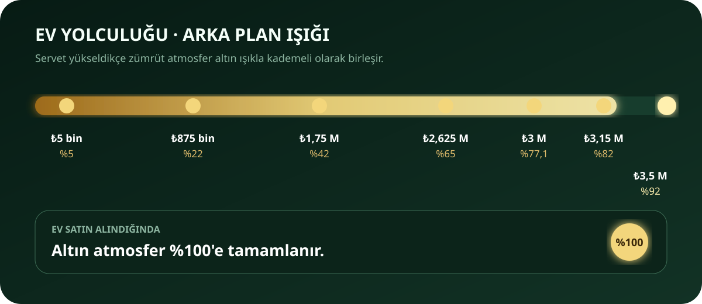

# TradeUp ₺3 Milyon ve Ev Hedefi Simülasyonu

Tarih: 8 Eylül 2026  
Katalog: 189 oynanabilir ürün ailesi

Emlak araştırma eşiği: ₺3.500.000

Ev fiyatları: ₺3.750.000–₺7.250.000

## Yöntem

Bu rapor `src/analysis/careerSimulation.ts` içindeki tekrarlanabilir denge probundan üretildi. Aynı tohum her zaman aynı sonucu verir. 100 farklı piyasa tohumu çalıştırıldı.

Model, dikkatli ama kusursuz olmayan bir oyuncuyu temsil eder:

- Başlangıç nakdi ₺420'dir.
- Oyuncu yalnızca ekranda gösterilen ihtiyatlı fiyat tahmini alış fiyatından en az %3 yüksekse ürünü alır.
- Bilgi seviyesi her altı tamamlanmış ticarette kademeli artar ve 10. seviyede durur.
- Satış sonucu, mevcut alıcı teklif motorunun olağan değer bandında deterministik olarak örneklenir.
- Tek seferde tek alış-satış tamamlanır; ücretsiz para, reklam ödülü, gizli gerçek değer avantajı veya ekonomi dışı bonus kullanılmaz.
- Sonuçlar bekleme süresi değil, tamamlanan ticaret sayısıdır. Gerçek takvim süresi oyuncunun satışları ne sıklıkla takip ettiğine bağlıdır.

## Sonuç

| Nokta                         |               Medyan ticaret | Arka plan altını |
| ----------------------------- | ---------------------------: | ---------------: |
| ₺5.000                        |                           12 |               %5 |
| ₺875.000                      |                          162 |              %22 |
| ₺1.750.000                    |                          201 |              %42 |
| ₺2.625.000                    |                          227 |              %65 |
| ₺3.000.000                    |                          241 |            %77,1 |
| ₺3.150.000                    |                          243 |              %82 |
| ₺3.500.000, ev araması açılır |                          255 |              %92 |
| Ev satın alındı               | seçilen evin nakit bedelinde |             %100 |

100 koşuda ev hedefi için tamamlanan ticaret sayısı:

- Hızlı koşu (yüzde 10): 232 ticaret
- Medyan koşu: 255 ticaret
- Yavaş koşu (yüzde 90): 291 ticaret
- Medyan koşuda fırsat bulmak için 31 piyasa yenilemesi

## Denge yorumu

₺3 milyon medyanda 241 ticarette, ₺3,5 milyonluk emlak arama eşiği ise 255 ticarette erişiliyor. Bu eşik ev satın alımı değildir; en ucuz ev ₺3,75 milyon, en pahalı ev ₺7,25 milyondur. Son bölümde yüksek bütçeli ürünlerin tek ticarette daha büyük mutlak kâr üretmesi nedeniyle bazı eşikler aynı ticarette aşılabiliyor.

Bu sonuç uzun süreli mobil simülasyon için beta sırasında ölçülecek hedeftir. Oyuncu oturum başına ortalama 3–5 başarılı ticaret bitirirse emlak araştırması medyanda yaklaşık 51–85 aktif oturuma karşılık gelir. Seçilen evin gerçek satın alma süresi bunun üzerindedir. Beta testinde ilk izlenecek ölçüler; ilk ₺5.000'e ulaşma, ₺875.000'e ulaşma, kârlı ticaret başına süre ve oyuncunun hangi servet basamağında ayrıldığı olmalıdır.

Yeni 32 ürün başlangıç ve orta seviyede çeşitlilik sağlar; araç basamağını erkene çekmez. Bu nedenle içerik artışı tek başına ev hedefini yapay olarak kolaylaştırmaz. Simülasyon bir denge ölçüm aracıdır, canlı oyun kuralı değildir ve fiyat motorunu değiştirmez. Tablodaki her ara eşik artık aynı 100 tohumluk örnekten hesaplanır ve otomatik testte birebir korunur.

Son dört araç Tier 5’te açılır ve farklı değer, talep, satış hızı ile teknik kanıt profillerine sahiptir. Güncel katalog önceki 185 ürünlü sürüme göre emlak arama eşiğini medyan 282’den 255 ticarete indirir; yaklaşık %10’luk bu hızlanma beta analizinde özellikle izlenmelidir.
